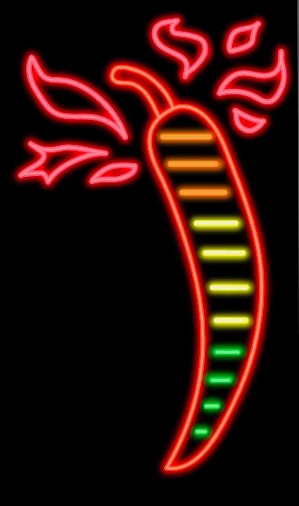

# Hot Sauce Meter

* [x] create app
* [x] create scoville meter component
* [x] overlay all images
* [x] hide / show images based on scoville value
  * [x] show scoville value below image
  * [x] animate up to given level

# Hot Ones Sauce List

* [ ] List seasons in UI
* [ ] Show sauces for a season in UI
* [ ] Click sauce to see scoville rating and info in UI
